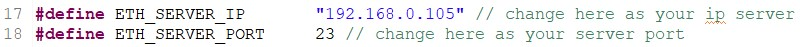
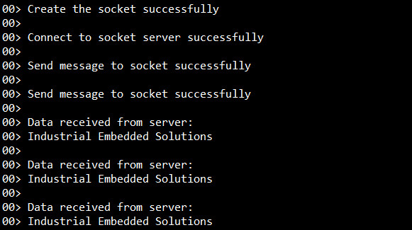
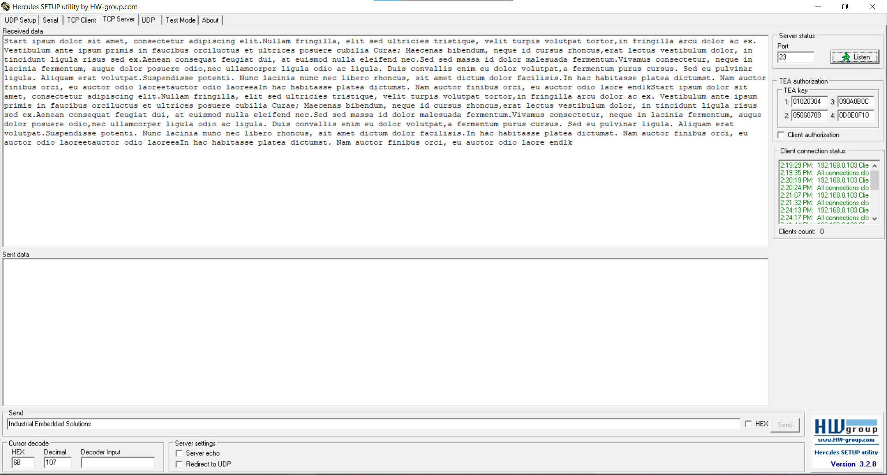
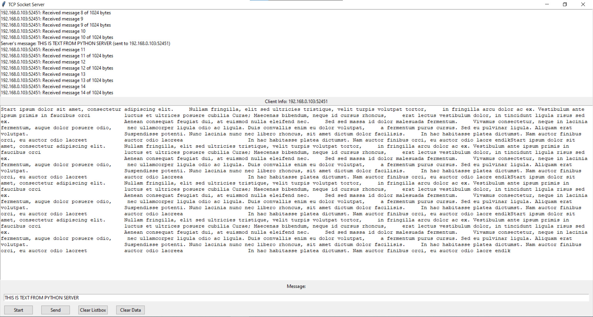

# LWIP Socket Send and Receive Example for STM32

## Introduction

This repository contains an example project that demonstrates how to use the LWIP (Lightweight IP) library and FREERTOS on an STM32 microcontroller, specifically STM32F429ZIT6 Nucleo board, to send and receive data using socket API. The example showcases the setup and usage of LWIP to establish network communication over Ethernet and demonstrates client functionality.

## Getting Started

### Prerequisites

Before you begin, ensure that you have the following prerequisites:

- STM32 development board with Ethernet connectivity, we use STM32F429ZIT6 Nucleo board for this example.
- STM32CubeIDE and STM32CubeMX for STM32 development.
- Ethernet cable to connect to the router. 
- Router with Ethernet ports to configure IP for STM32 development board and server.

### Installation

1. Clone this repository to your local machine.
2. Open the project in your preferred STM32 development environment.
3. Configure the necessary settings such as microcontroller selection, linker script, and system clock.
  
## Usage

1. Open the project in STM32CubeIDE.
2. Configure the IP address server settings for the client applications in line 17, 18 of the `socket_client.c` file and in line 12, 69 of the `socket_server.py` file.

  - `socket_client.c`:  

  - `socket_server.py`:

3. Build and flash the client applications code to separate STM32 development boards.
4. Run python socket_server.py or use Hercules SETUP utility to run server application.
5. Use debugging tools to monitor the status of the communication and the messages communicated by the client.

## Test result

### Test STM32 client sending data to server and receiving data form server 

### Test server

#### Test server using Hercules tool to check the client connection status, data received from client and send data to client
   

#### Test server using Python application to receive data form client, check the size of data received and send data to client

